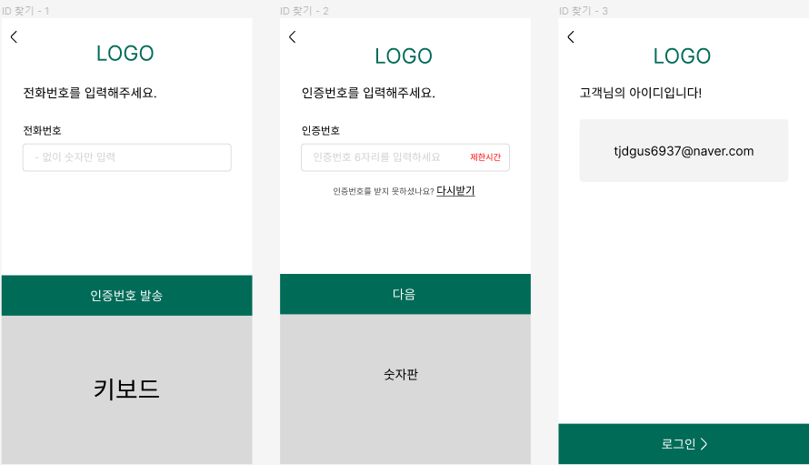
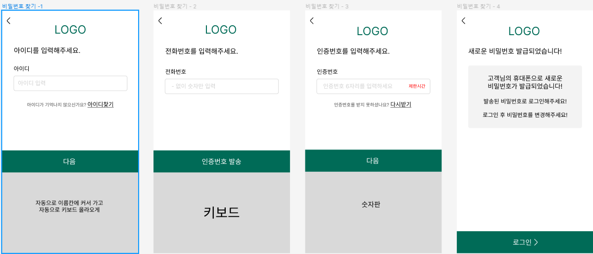
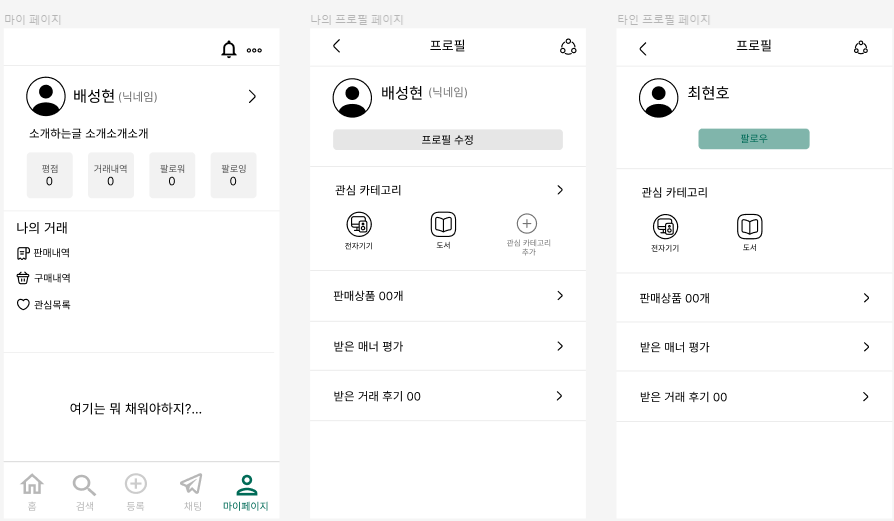

# 0110

## 피그마 작성

- ID 찾기



- 비밀번호 찾기



- 마이페이지 및 프로필 페이지 수정



## 리액트

## 리액트의 이벤트 시스템

리액트에서의 이벤트 시스템은 HTML과 유사하다. 하지만 몇가지 주의 사항이 있다.

### 이벤트 사용할 때 주의 사항

1. 이벤트 이름은 카멜표기법으로 작성한다.

   ex) HTML에서는 onclick 이지만, 리액트에서는 onClick이다.

2. 이벤트에 실행할 자바스크립트 코드를 전달하는 것이 아니라, 함수 형태의 값을 전달한다.

   HTML에서는 큰따옴표 안에 실행할 코드(method의 코드)를 작성했지만, 리액트에서는 함수 형태의 객체(함수의 return값을 사용??)를 전달한다.

3. DOM 요소에만 이벤트를 설정할 수 있다.

   HTML 태그들에는 이벤트를 설정할 수 있지만, 컴포넌트에는 이벤트 설정이 불가능하다.

   ex) <MyComponent onClick={doSomething} />은 불가능하다.

### 이벤트의 종류

리액트 공식문서 이벤트 종류 : [](https://ko.reactjs.org/docs/events.html#gatsby-focus-wrapper)https://ko.reactjs.org/docs/events.html#gatsby-focus-wrapper

---

## 이벤트 예제

이벤트 핸들링 과정

1. 컴포넌트 생성 및 불러오기
2. onChange 이벤트 핸들링하기
3. 임의 메서드 만들기
4. input 여러개 다루기
5. onKeyPress 이벤트 핸들링하기

---

### 컴포넌트 생성(클래스형)

```jsx
import { Component } from "react";

class EventPractice extends Component {
  render() {
    return (
      <div>
        <h1>이벤트 연습</h1>
      </div>
    );
  }
}

export default EventPractice;
```

App 컴포넌트에서 EventPractice 불러와 렌더링하기

```jsx
import "./App.css";
import EventPractice from "./EventPractice";

function App() {
  return <EventPractice />;
}

export default App;
```

### onChange 이벤트 핸들링하기

onChange는 vue에서 v-model과 사용 방법이 비슷하다고 생각하면된다. input에서 어떠한 변화가 있으면 그 변화를 감지하는 이벤트이다.

```jsx
import { Component } from "react";

class EventPractice extends Component {
  render() {
    return (
      <div>
        <h1>이벤트 연습</h1>
        <input
          type="text"
          name="message"
          placeholder="아무거나 입력해 보세요"
          onChange={(e) => {
            console.log(e.target.value);
          }}
        />
      </div>
    );
  }
}

export default EventPractice;
```

e.target.value를 사용하면 input에 입력되는 값들을 알 수 있다.

### state에 input 값 담기

```jsx
import { Component } from "react";

class EventPractice extends Component {
  // state의 초기값 설정
  state = {
    message: "",
  };

  render() {
    return (
      <div>
        <h1>이벤트 연습</h1>
        <input
          type="text"
          name="message"
          placeholder="아무거나 입력해 보세요"
          // value값 설정하고
          value={this.state.message}
          // 입력값이 있을 때 state의 message값을 변경
          onChange={(e) => {
            this.setState({
              message: e.target.value,
            });
          }}
        />
        // 클릭 시 state의 message값을 출력 후 공백으로 설정
        <button
          onClick={() => {
            alert(this.state.message);
            this.setState({
              message: "",
            });
          }}
        >
          확인
        </button>
      </div>
    );
  }
}

export default EventPractice;
```

### 임의 메서드 활용

위에서는 이벤트 내부에서 함수를 만들어서 전달해 주었다. 하지만 이 방법 보다 함수를 미리 준비하여 전달하는 방식이 가독성이 더 높다.

```jsx
import { Component } from "react";

class EventPractice extends Component {
  // state의 초기값 설정
  state = {
    message: "",
  };
  // 메서드를 바인딩 해야 this에서 꼬이지 않는다.
  constructor(props) {
    super(props);
    this.handleChange = this.handleChange.bind(this);
    this.handleClick = this.handleClick.bind(this);
  }
  handleChange(e) {
    this.setState({
      message: e.target.value,
    });
  }
  handleClick() {
    alert(this.state.message);
    this.setState({
      message: "",
    });
  }
  render() {
    return (
      <div>
        <h1>이벤트 연습</h1>
        <input
          type="text"
          name="message"
          placeholder="아무거나 입력해 보세요"
          // value값 설정하고
          value={this.state.message}
          // 입력값이 있을 때 state의 message값을 변경
          onChange={this.handleChange}
        />
        <button onClick={this.handleClick}>확인</button>
      </div>
    );
  }
}

export default EventPractice;
```

함수가 호출될 때 this는 호출부에 따라 결정되므로, 클래스의 임의 메서드가 특정 HTML 요소의 이벤트로 등록되는 과정에this가 컴포넌트 자신으로 제대로 가리키기 위해서는 메서드를 this와 바인딩 하는 작업이 필요하다. 위 코드에서는 constructor(생성자 메서드)에서 진행하지만, transform-class-properties문법을 사용하여 화살표 함수 형태로 메서드를 정의할 수 있다.

(이거 vue에서 화살표함수를 사용하는 이유에서 있던거같은데… 화살표 함수에서의 this는 상위 단계에서만 찾기 때문이고, 일반 함수에서는 this를 쓰게되면 window에서 찾는다? 이런거였나…)

```jsx
import { Component } from "react";

class EventPractice extends Component {
  // state의 초기값 설정
  state = {
    message: "",
  };
  // 메서드 등록할 때 화살표 함수를 사용
  handleChange = (e) => {
    this.setState({
      message: e.target.value,
    });
  };
  handleClick = () => {
    alert(this.state.message);
    this.setState({
      message: "",
    });
  };
  render() {
    return (
      <div>
        <h1>이벤트 연습</h1>
        <input
          type="text"
          name="message"
          placeholder="아무거나 입력해 보세요"
          // value값 설정하고
          value={this.state.message}
          // 입력값이 있을 때 state의 message값을 변경
          onChange={this.handleChange}
        />
        <button onClick={this.handleClick}>확인</button>
      </div>
    );
  }
}

export default EventPractice;
```

### input 여러 개 다루기

input이 여러개 일때 event 객체를 활용하면 메서드를 여러개 만들지 않고도 사용이 가능하다. [e.target.name](http://e.target.name) 값을 사용하면 해당 인풋의 name을 가리킨다. state의 값을 그대로 사용하는 것이 아니라 input별로 name을 state의 키값과 동일하게 설정하여 이를 활용하는 방식이다.

```jsx
import { Component } from "react";

class EventPractice extends Component {
  // state의 초기값 설정
  state = {
    message: "",
    username: "",
  };
  // 객체 안에서 key값을 []로 감싸면 그 안에 넣은 값이 객체의 key값이 된다
  // 딕셔너리 값 추가 하는 방법과 동일하다.
  handleChange = (e) => {
    this.setState({
      [e.target.name]: e.target.value,
    });
  };
  handleClick = () => {
    alert(this.state.username + ":" + this.state.message);
    this.setState({
      message: "",
      username: "",
    });
  };
  render() {
    return (
      <div>
        <h1>이벤트 연습</h1>
        <input
          type="text"
          name="username"
          placeholder="사용자명"
          value={this.state.username}
          onChange={this.handleChange}
        />
        <input
          type="text"
          name="message"
          placeholder="아무거나 입력해 보세요"
          // value값 설정하고
          value={this.state.message}
          // 입력값이 있을 때 state의 message값을 변경
          onChange={this.handleChange}
        />
        <button onClick={this.handleClick}>확인</button>
      </div>
    );
  }
}

export default EventPractice;
```

### onKeyPress 이벤트 핸들링

keypress 이벤트는 키를 눌렀을 때 발생한다. 엔터키 누르는 상황에서 주로 사용하게 된다.

```jsx
import { Component } from "react";

class EventPractice extends Component {
  // state의 초기값 설정
  state = {
    message: "",
    username: "",
  };
  // 객체 안에서 key값을 []로 감싸면 그 안에 넣은 값이 객체의 key값이 된다
  // 딕셔너리 값 추가 하는 방법과 동일하다.
  handleChange = (e) => {
    this.setState({
      [e.target.name]: e.target.value,
    });
  };
  handleClick = () => {
    alert(this.state.username + ":" + this.state.message);
    this.setState({
      message: "",
      username: "",
    });
  };
  // 엔터가 눌렸을 때 버튼이 눌리게 만든다.
  handleKeyPress = (e) => {
    if (e.key === "Enter") {
      this.handleClick();
    }
  };
  render() {
    return (
      <div>
        <h1>이벤트 연습</h1>
        <input
          type="text"
          name="username"
          placeholder="사용자명"
          value={this.state.username}
          onChange={this.handleChange}
        />
        <input
          type="text"
          name="message"
          placeholder="아무거나 입력해 보세요"
          // value값 설정하고
          value={this.state.message}
          // 입력값이 있을 때 state의 message값을 변경
          onChange={this.handleChange}
          onKeyPress={this.handleKeyPress}
        />
        <button onClick={this.handleClick}>확인</button>
      </div>
    );
  }
}

export default EventPractice;
```

## 함수 컴포넌트로 구현

함수 컴포넌트에서는 useState를 사용해서 진행한다.

```jsx
import { useState } from "react";

const EventPractice = () => {
  const [username, setUsername] = useState("");
  const [message, setMessage] = useState("");
  const onChangeUsername = (e) => setUsername(e.target.value);
  const onChangeMessage = (e) => setMessage(e.target.value);
  const onClick = () => {
    alert(username + ": " + message);
    setUsername("");
    setMessage("");
  };
  const onKeyPress = (e) => {
    if (e.key === "Enter") {
      onClick();
    }
  };
  return (
    <div>
      <h1>이벤트 연습</h1>
      <input
        type="text"
        name="username"
        placeholder="사용자명"
        value={username}
        onChange={onChangeUsername}
      />
      <input
        type="text"
        name="message"
        placeholder="아무거나 입력해 보세요"
        value={message}
        onChange={onChangeMessage}
        onKeyPress={onKeyPress}
      />
      <button onClick={onClick}>확인</button>
    </div>
  );
};
export default EventPractice;
```

위 코드에서는 e.target.name을 활용하지 않고 onChange관련 함수를 두 개 따로 만들었다. 위 경우에서는 가능하지만 input이 많아지면 e.target.name을 사용하는것이 권장된다.

e.target.name을 사용하는 경우, form객체를 사용해야한다.

```jsx
import { useState } from "react";

const EventPractice = () => {
  const [form, setForm] = useState({
    username: "",
    message: "",
  });
  const { username, message } = form;
  const onChange = (e) => {
    const nextForm = {
      ...form, // 기존 form 내용을 이 자리에 복사한뒤
      [e.target.name]: e.target.value, // 원하는 값을 덮어 씌우기
    };
    setForm(nextForm);
  };
  const onClick = () => {
    alert(username + ": " + message);
    setForm({
      username: "",
      message: "",
    });
  };
  const onKeyPress = (e) => {
    if (e.key === "Enter") {
      onClick();
    }
  };
  return (
    <div>
      <h1>이벤트 연습</h1>
      <input
        type="text"
        name="username"
        placeholder="사용자명"
        value={username}
        onChange={onChange}
      />
      <input
        type="text"
        name="message"
        placeholder="아무거나 입력해 보세요"
        value={message}
        onChange={onChange}
        onKeyPress={onKeyPress}
      />
      <button onClick={onClick}>확인</button>
    </div>
  );
};
export default EventPractice;
```
