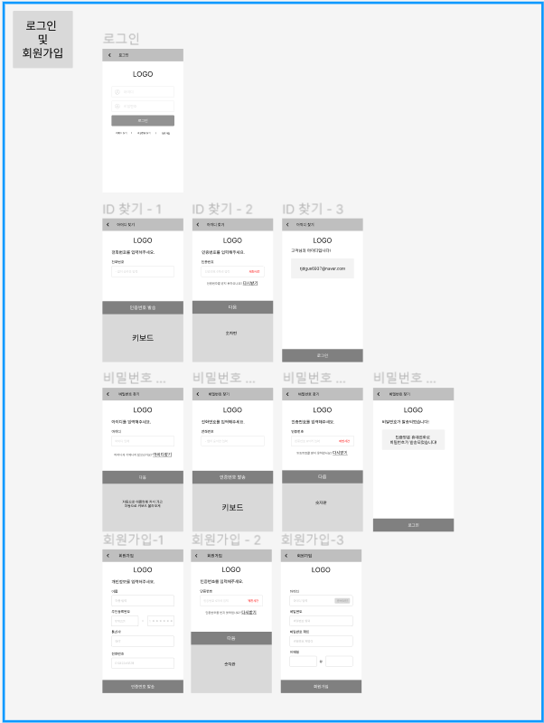
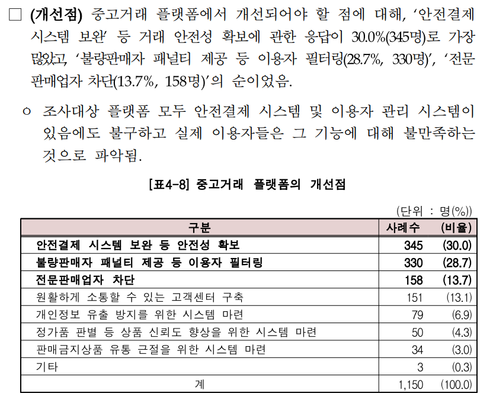

# 0111

## 피그마 수정



Material Design 의 규격대로 기존 피그마 수정

## 중고 거래 시장 현황 자료 찾기

* 중고물품 사진으로 경매 하는 사이트

https://www.ajunews.com/view/20220413073656626

* 중고거래 플랫폼 소비자 문제 실태조사



## 리액트 공부

## 비동기 작업의 이해

웹 애플리케이션을 만들다 보면 처리할 때 시간이 걸리는 작업이 있다. 예를 들어 웹 애플리케이션에서 서버 쪽 데이터가 필요할 때 Ajax 기법을 사용하여 서버의 API를 호출함으로써 데이터를 수신한다. 이렇게 서버의 API를 사용해야 할 때는 네트워크 송수신 과정에서 시간이 걸리기 때문에 작업이 즉시 처리되는 것이 아니라, 응답을 받을 때까지 기다렸다가 전달받은 응답 데이터를 처리한다.

작업을 동기적으로 처리한다면, 요청이 끝날 때 까지 기다리는 동안 중지 상태가 되기 때문에 다른 작업을 할 수 없다. 반면, 비동기적으로 처리를 한다면 웹 애플리케이션이 멈추지 않기 때문에 동시에 여러가지 요청을 처리할 수도 있고, 기다리는 과정에서 다른 함수도 호출할 수 있다.

API 말고도 setTimeout 함수를 사용하여 특정 작업을 예약할 때 작업을 비동기로 처리해야한다. setTimeout이 사용되는 시점에서 코드가 3초동안 멈추는 것이 아니라 코드가 모두 호출되고 3초 뒤에 우리가 지정해준 코드가 실행된다.

자바스크립트에서 비동기 작업을 할 때 흔히 사용하는 방법은 콜백함수를 사용하는 것이다.

### 콜백함수

### Promise

Promise는 콜백 지옥 같은 코드가 형성되지 않게 하는 방안이다.

### async/await

async/await 는 Promise를 더욱 쉽게 사용할 수 있도록 해 주는 문법이다.

---

## axios로 API 호출해서 데이터 받아오기

```jsx
$ yarn create react-app news-viewer
$ cd news-viewer
$ yarn add axios
```

```jsx
import { useState } from 'react';
import axios from 'axios';

const App = () => {
  const [data, setData] = useState(null);
  const onClick = () => {
    axios.get('<https://jsonplaceholder.typicode.com/todos/1>').then(response => {
      setData(response.data);
    });
  };

  return (
    <div>
      <div>
        <button onClick={onClick}>불러오기</button>
      </div>
      {data && <textarea rows={7} value={JSON.stringify(data, null, 2)} readOnly={true} />}
    </div>
  );
};

export default App;
```

위 코드에 async를 적용해 보면, 아래와 같다.

```jsx
import { useState } from 'react';
import axios from 'axios';

const App = () => {
  const [data, setData] = useState(null);
  const onClick = async () => {
    try {
      const response = await axios.get(
        '<https://jsonplaceholder.typicode.com/todos/1>',
      );
      setData(response.data)
    } catch (e) {
      console.log(e);
    }
  };

  return (
    <div>
      <div>
        <button onClick={onClick}>불러오기</button>
      </div>
      {data && <textarea rows={7} value={JSON.stringify(data, null, 2)} readOnly={true} />}
    </div>
  );
};

export default App;
```

## newsapi API

newsapi 에서 제공하는 API를 사용하여 뉴스를 불러온다. 가입 후 API 키를 발급 받는다.


- 전체 뉴스 불러오기
  
  https://newsapi.org/v2/top-headlines?**country=kr** &apiKey=67571b7b689f4a5794581ea6b745cc2c

- 특정 카테고리 불러오기
  
  https://newsapi.org/v2/top-headlines?**country=kr** &category=business&apiKey=67571b7b689f4a5794581ea6b745cc2c

```jsx
import { useState } from 'react';
import axios from 'axios';

const App = () => {
  const [data, setData] = useState(null);
  const onClick = async () => {
    try {
      const response = await axios.get(
        '<https://newsapi.org/v2/top-headlines?country=kr&apiKey=67571b7b689f4a5794581ea6b745cc2c>',
      );
      setData(response.data)
    } catch (e) {
      console.log(e);
    }
  };

  return (
    <div>
      <div>
        <button onClick={onClick}>불러오기</button>
      </div>
      {data && <textarea rows={7} value={JSON.stringify(data, null, 2)} readOnly={true} />}
    </div>
  );
};

export default App;
```

## 뉴스 뷰어 UI 만들기

styled-components를 사용하여 뉴스 정보를 보여 줄 컴포넌트를 만든다.

```jsx
$ yarn add styled-components
```

src안에 components 폴더를 만들고 그 안에 NewsItem.js(각 뉴스 정보를 보여주는 컴포넌트)와 NewsList.js(API를 요청하고 뉴스 데이터가 들어 있는 배열을 컴포넌트 배열로 변환해 렌더링 해주는 컴포넌트) 파일을 생성한다.

### NewsItem 만들기

API로 받은 데이터는 각 뉴스 데이터가 지니고 있는 정보로 이루어진 JSON 객체다. NewsItem은 article을 props로 통째로 받아와서 사용한다.

```jsx
import styled from "styled-components";

const NewsItemBlock = styled.div`
  display: flex;
  .thumbnail {
    margin-right: 1rem;
    img {
      display: block;
      width: 160px;
      height: 100px;
      object-fit: cover;
    }
  }
  .contents {
    h2 {
      margin: 0;
      a {
        color: black;
      }
    }
    p {
      margin: 0;
      line-height: 1.5;
      margin-top: 0.5rem;
      white-space: normal;
    }
  }
  & + & {
    margin-top: 3rem;
  }
`;

const NewsItem = ({ article }) => {
  const { title, description, url, urlToImage} = article;

  return (
    <NewsItemBlock>
      {urlToImage && (
        <div className="thumbnail">
          <a href={url} target="_blank" rel="noopener noreferrer">
            
          </a>
        </div>
      )}
      <div className="contents">
        <h2>
          <a href={url} target="_blank" rel="noopener noreferrer">
            {title}
          </a>
        </h2>
        <p>{description}</p>
      </div>
    </NewsItemBlock>
  );
};

export default NewsItem;
```

### NewsList만들기

```jsx
import styled from "styled-components";
import NewsItem from "./NewsItem";

const NewsListBlank = styled.div`
  box-sizing: border-box;
  padding-bottom: 3rem;
  width: 768px;
  margin: 0 auto;
  margin-top: 2rem;
  @media screen and (max-width: 786px) {
    width: 100%;
    padding-left: 1rem;
    padding-right: 1rem;
  }
`;

const sampleArticle = {
  title: '제목',
  description: '내용',
  url: '<https://google.com>',
  urlToImage: '<https://via.placeholder.com/160>'
};

const NewsList = () => {
  return (
    <NewsListBlank>
      <NewsItem article={sampleArticle} />
      <NewsItem article={sampleArticle} />
      <NewsItem article={sampleArticle} />
      <NewsItem article={sampleArticle} />
      <NewsItem article={sampleArticle} />
      <NewsItem article={sampleArticle} />
    </NewsListBlank>
  );
};

export default NewsList;
```

```jsx
import NewsList from "./components/NewsList";

const App = () => {
  return <NewsList />
}

export default App;
```

## 데이터 연동하기

NewsList 컴포넌트에서 이전에 연습 삼아 사용했던 API 호출을 한다. useEffect 사용하여 컴포넌트가 처음 렌더링되는 시점에 API를 요청하면 된다. useEffect에 등록하는 함수에 async를 붙이면 안된다. useEffect에서 반환해야 하는 값은 뒷정리 함수이기 때문이다. 추가로 loading이라는 상태도 관리하여 API 요청이 대기중인지 판별한다.

```jsx
import styled from "styled-components";
import NewsItem from "./NewsItem";
import { useState, useEffect } from 'react';
import axios from 'axios';

const NewsListBlock = styled.div`
  box-sizing: border-box;
  padding-bottom: 3rem;
  width: 768px;
  margin: 0 auto;
  margin-top: 2rem;
  @media screen and (max-width: 786px) {
    width: 100%;
    padding-left: 1rem;
    padding-right: 1rem;
  }
`;

const NewsList = () => {
  const [ articles, setArticles ] = useState(null);
  const [ loading, setLoading ] = useState(false);

  useEffect(() => {
    // async를 사용하는 함수 따로 선언
    const fetchData = async () => {
      setLoading(true);
      try {
        const response = await axios.get (
          '<https://newsapi.org/v2/top-headlines?country=kr&apiKey=67571b7b689f4a5794581ea6b745cc2c>',
        );
        setArticles(response.data.articles);
      } catch (e) {
        console.log(e);
      }
      setLoading(false);
    };
    fetchData();
  }, []);

  // 대기 중일 때
  if (loading) {
    return <NewsListBlock> 대기 중 ...</NewsListBlock>
  }
  // articles값이 설정되지 않았을 때
  if (!articles) {
    return null;
  }

  // articles 값이 유효할 때
  return (
    <NewsListBlock>
      {articles.map(article => (
        <NewsItem key={article.url} article={article} />
      ))}
    </NewsListBlock>
  );
};

export default NewsList;
```

받아온 데이터 배열을 map 함수를 사용하여 컴포넌트 배열로 변환할 때 !articles를 조회하여 해당 값이 현재 null이 아닌지를 검사해야한다. 그렇지 않으면 articles가 null 일때 map함수를 실행하기 때문에 오류가 발생한다.


