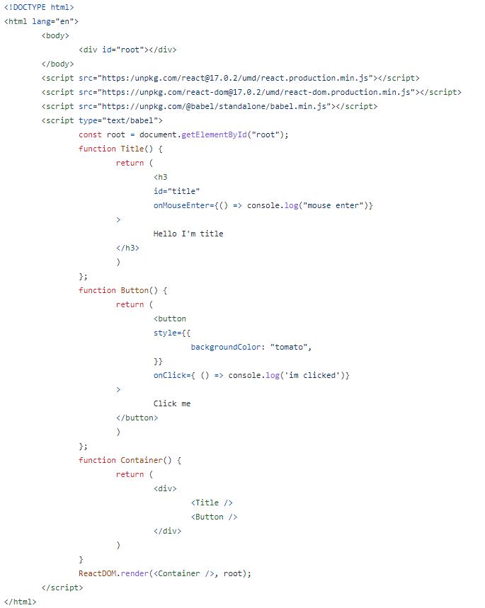
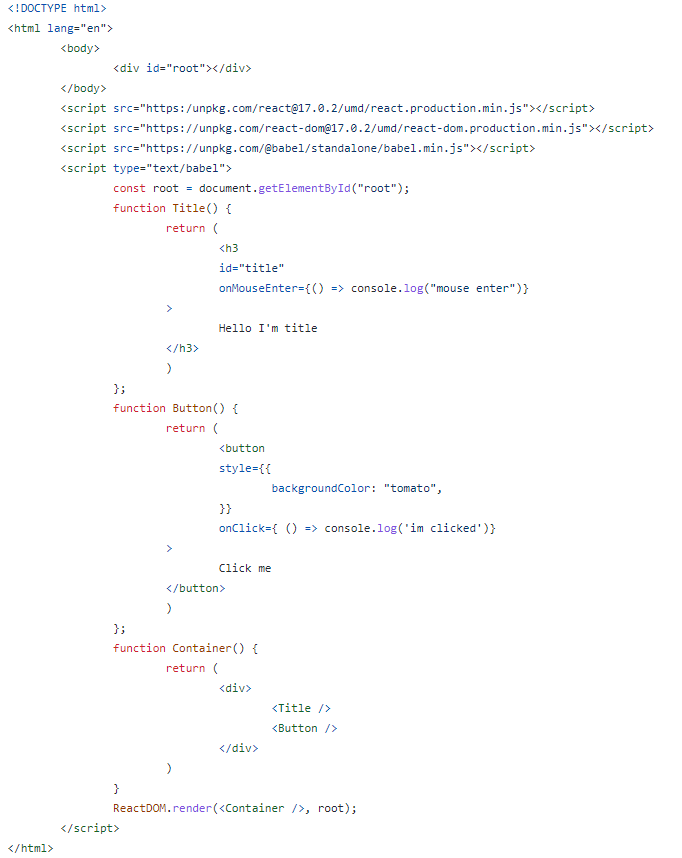
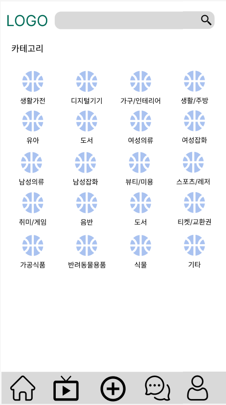
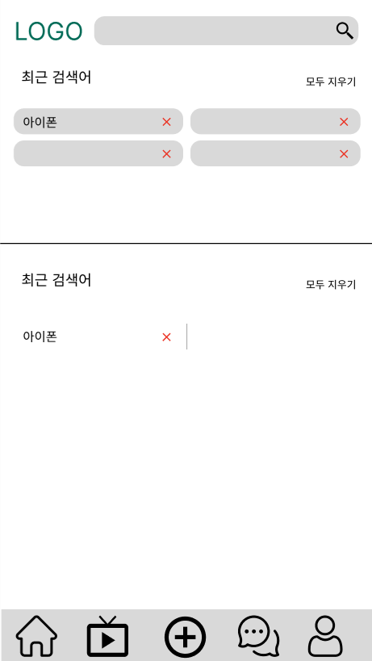
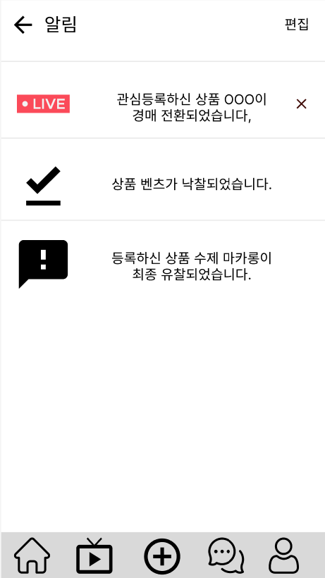

# 첫주차 (월)

1. 프론트엔드 개발을 맡아 리액트를 사용하기 위하여 노마드코더 및 생활코딩 동영상을 학습하여 기본이 되는 바닐라 코드 작성. (동영상 강의는 2023.01.12일까지 수강완료 예정)

1. 프론트엔드를 담당하는 팀원과 피그마를 사용하여 홈페이지 테마 결정 및 제작. (홈페이지, 카테고리, 검색, 알림창을 제작)

3. git 활용을 위해 브랜치 생성 및 삭제에 대한 학습.

https://www.youtube.com/watch?v=FXDjmsiv8fI

https://www.youtube.com/playlist?list=PLHF1wYTaCuixewA1hAn8u6hzx5mNenAGM